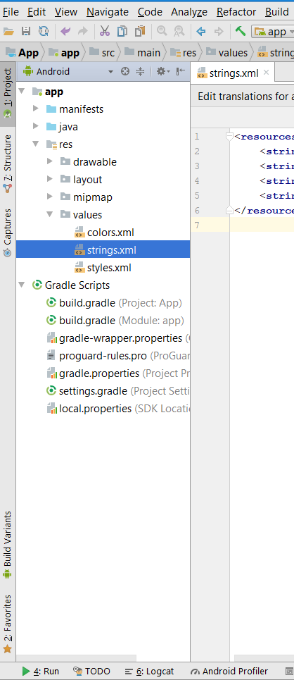
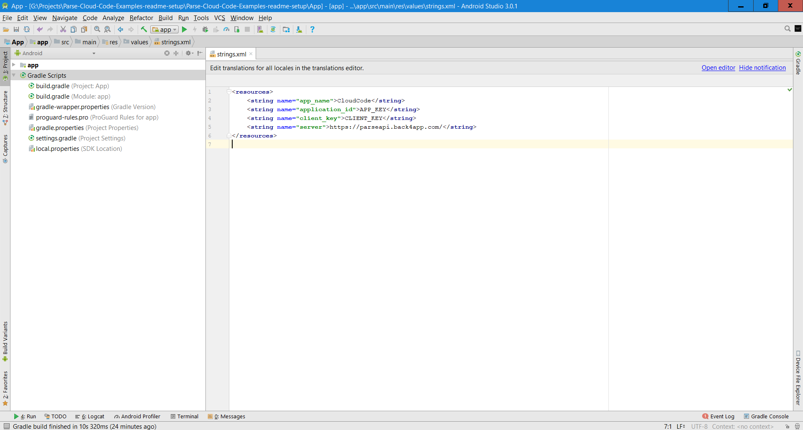
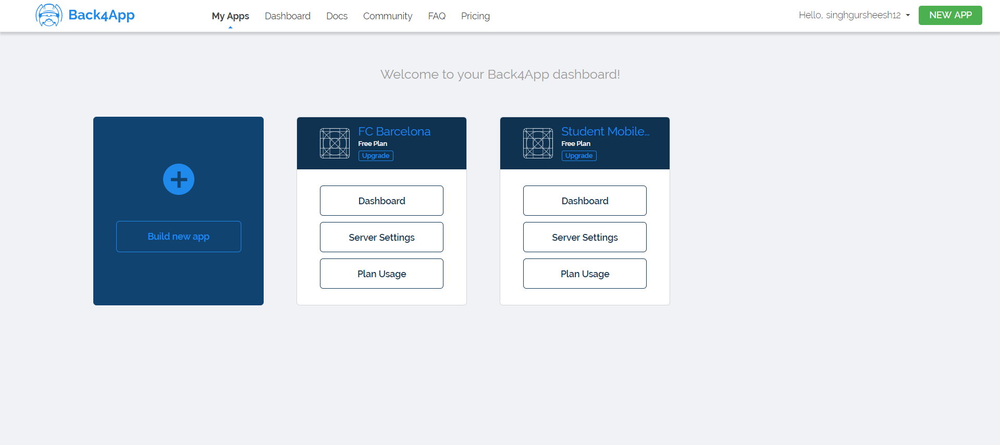
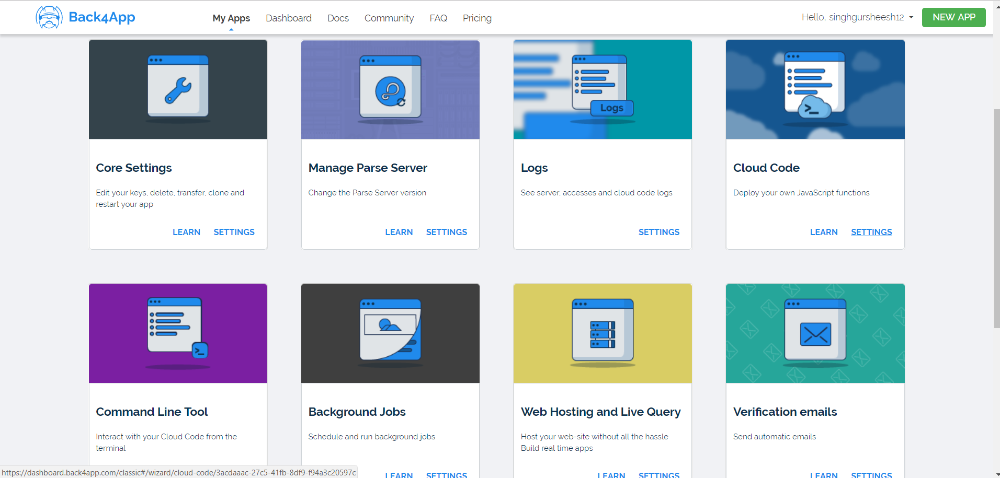
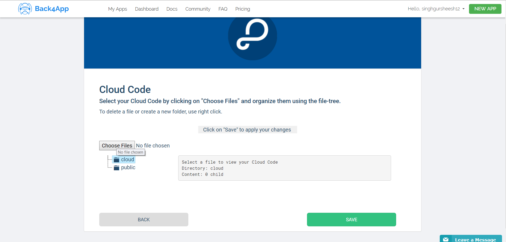
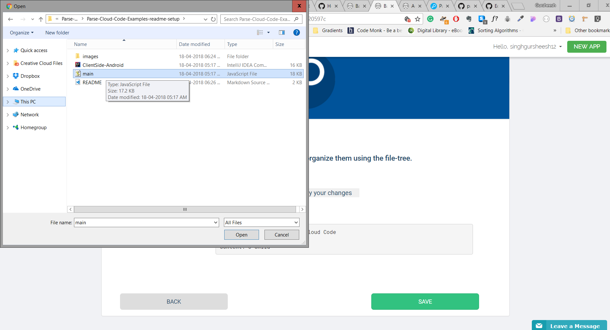
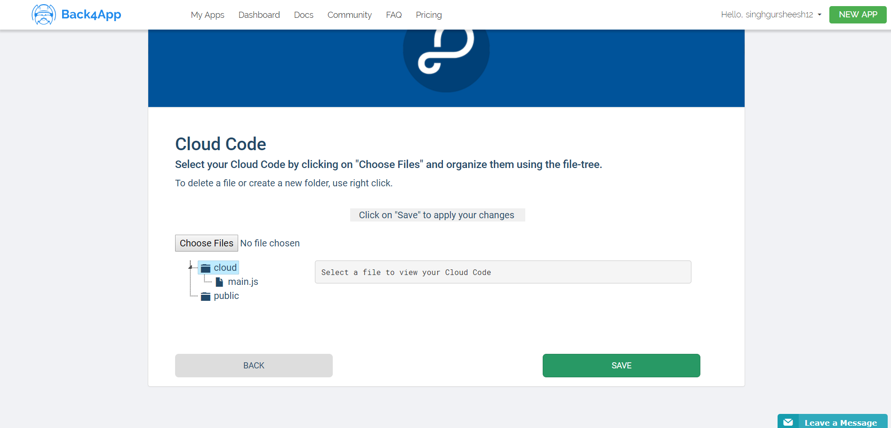
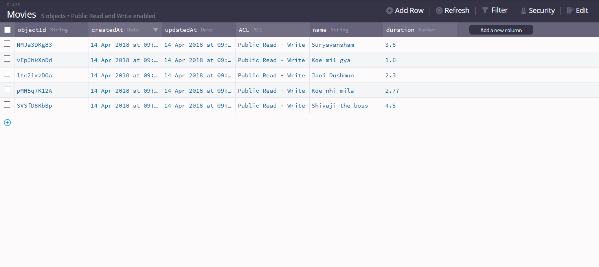
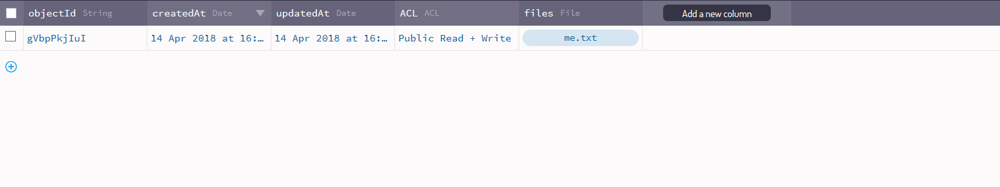
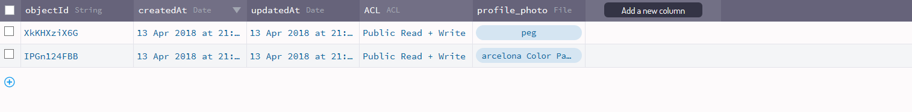

# Parse-Cloud-Code-Examples

## Settting Up Parse Server

First of all you are required to setup a parse server where you can easily deploy Cloud Code.

You can setup Parse Server on various platforms -
* Heroku and mLab
* AWS and Elastic Beanstalk
* Google App Engine
* Microsoft Azure
* SashiDo
* Digital Ocean
* Pivotal Web Services
* Back4app
* Gomix
* Flynn

How to setup

* [Running Parse Server elsewhere](https://github.com/parse-community/parse-server#running-parse-server-elsewhere)

* [Setup tutorials](https://github.com/parse-community/parse-server/wiki)

* [Parse Server Setup On AWS](https://docs.bitnami.com/aws/apps/parse/#first-steps-with-the-bitnami-parse-server-stack)

---
**NOTE**

I recommend setting up Parse server on [Back4App](https://www.back4app.com/)

* [Setup](https://www.youtube.com/watch?v=Em5grOlQNFQ)

---

## Setting up project on Android Studio

* First you need to download the app from the Github repo

* Now open the App on Android Studio

* Open strings.xml

    

* Now you need to make some changes in strings.xml

    1. Replace APP_KEY with your Server Application ID

    2. Replace CLIENT_KEY with your server Client Key

    3. If you are not using Back4app you need to replace the server string.

### How to get App ID and Client ID on Back4App

1. Go to your App Dashboard at Back4App website.

2. Navigate to app’s settings: Click on Features > Core Settings block > Server.

3. Return to your strings.xml file and paste your applicationId and clientKey

    

---
**NOTE**

No need to change server string for Back4App

---

#### How to configure Server String for AWS EC2

1. Go to the AWS console

2. Select EC2 Services

3. Open EC2 Instances

4. Select your parse EC2 instance

5. Copy EC2 Instance Public DNS.

6. Append Public DNS with  **/parse/**

7. Update it in strings.xml 

### How to upload Cloud code on Back4App

* First you need to open Server Setting for an app on Back4App Dashboard

    

* Now you need to select Cloud code setting.

    

* Now upload the cloud code file by clicking on Choose Files

    

* Now select the file containing Cloud Code

    

* Now click Save

    

Now Cloud code is updated to your Back4App server

## How to Configure Cloud Code on AWS

[Click here](https://docs.bitnami.com/aws/apps/parse/#how-to-add-your-custom-cloud-code-to-your-parse-server-stack)

## About Cloud Code

The **main.js** file contains the Cloud code.

There are 2 types of Cloud code

1. NoSQL based

2. MySQL based

## NoSQL Based

Number of NoSQL Based Cloud functions: 9

### NoSQL Classes Setup

* You need to make 3 Classes

1. Movies

    

    Fields:

    * name ( Type: String )
    * duration ( Type: Number )

2. Files

    

    Fields:

    * files ( Type: Files )

3. Profile Photo

    

    Fields:

    * profile_photo ( Type: Files )

---
**NOTE**

It is not necessary to enter same data in your classes.
However data entered must satisfy coloumn data type.

---    

